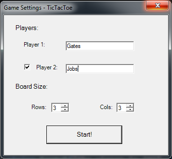
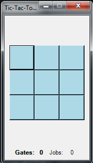
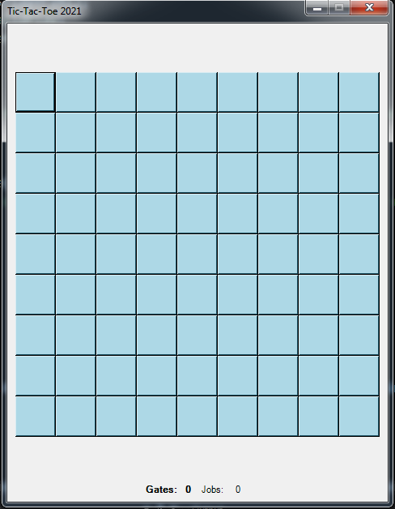
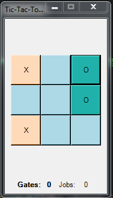
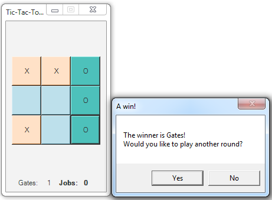
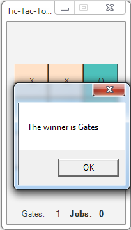

# TicTacToe game with a windows GUI
> This is a *reversed* tic-tac-toe game with a windows graphic user interface using WinForms.
> Written entirely in C#. The game has a settings set-up form and and 2 game modes to play:
>
>  - 2 players
> - player vs AI

Project made by:
 - Omer Moskowitz - <https://github.com/Mosko4>
 - Ohad Hodefi - <https://github.com/OhadHodefi>

## Instructions
Initial start of the game shows the settings form:

You can choose the size of the game board, change players' names and choose a game mode.

Enabling the 'Player 2' checkbox chooses the 2 players mode:

While leaving it disabled chooses the player vs AI mode. 

The size of the game board starts from 3x3:

All the way up to 9x9:

A player makes a move by clicking on one of the squares of the board:

If the game mode is player vs AI, then the AI will make its move immediately after choosing one of the squares.

When a sequence of matching squares is made, the player who made this sequence *loses* this round.

After a round is over, a message will be displayed asking to continue the game:

Choosing 'Yes' resets the game board and continues the game, while choosing 'No' announces the winner (if there is one) and finishes the game:

